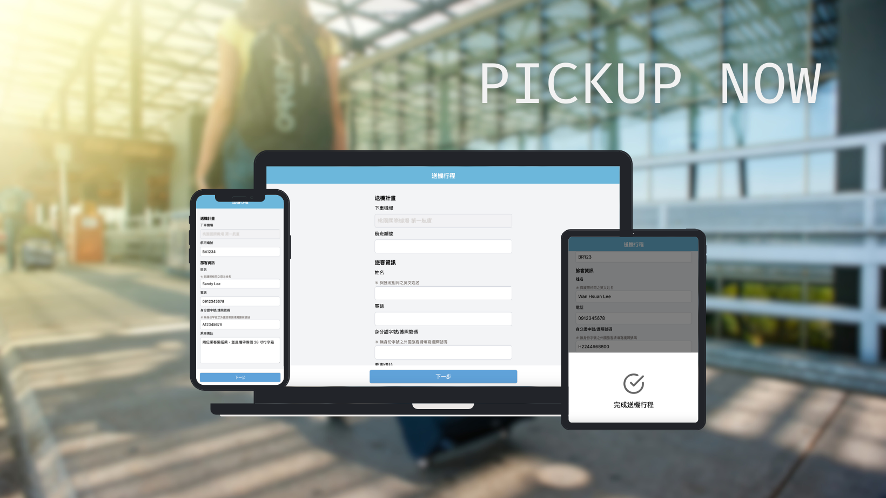

# 接機行程預約

## 作品說明

Pickup Now 是一款可以隨時隨地安排接機服務的產品，讓每一次旅行開始於無憂無慮，預約 Pickup Now 的機場接送服務，享受頂級舒適的旅途體驗。



1. 輸入班機與其他個人資料
2. 點擊下一步確認班機資訊，完成資料送出
3. 支援 RWD 格式

## 系統說明

### 運行方式

-   安裝依賴: `npm install`
-   啟動服務: `npm run dev`
-   Node.js 版本 v20.12.1

## 主要資料夾結構

```bash
├── src
│   └── app
│       ├── assets
│       │   ├── icon
│       │   └── intro
│       ├── components
│       │   ├── ButtonSheet.tsx
│       │   ├── Image.tsx
│       │   ├── LoadingSpinner.tsx
│       │   └── inputField.tsx
│       ├── favicon.ico
│       ├── globals.css
│       ├── hooks
│       │   ├── useFlightData.ts
│       │   └── useFormState.ts
│       ├── layout.tsx
│       ├── page.tsx
│       ├── service
│       │   └── flightFormat.ts
│       └── utils
│           └── status.ts
├── tailwind.config.ts
└── tsconfig.json
```

-   assets: 圖片資源檔案
-   components : 共用元件與頁面邏輯
-   hooks: 抽離的業務邏輯
-   page: 首頁畫面邏輯
-   utils：共用的 web utils

## 主要技術

-   Next.js with Typescript：使用 Next.js 為前端框架，搭配 TypeScript 撰寫
-   Vercel：網頁部署服務
-   Tailwind CSS：作為 CSS 框架

## 其他技術說明

-   專案使用 eslint + prettier 以維持程式碼整潔
-   eslint 檢查語法: `npm run lint`

## 資料來源

[TDX 運輸資料流通服務](https://tdx.transportdata.tw/api-service/swagger/basic/eb87998f-2f9c-4592-8d75-c62e5b724962#/)

## Demo 路徑

[Pickup Now](https://airline-schedule.vercel.app/)
